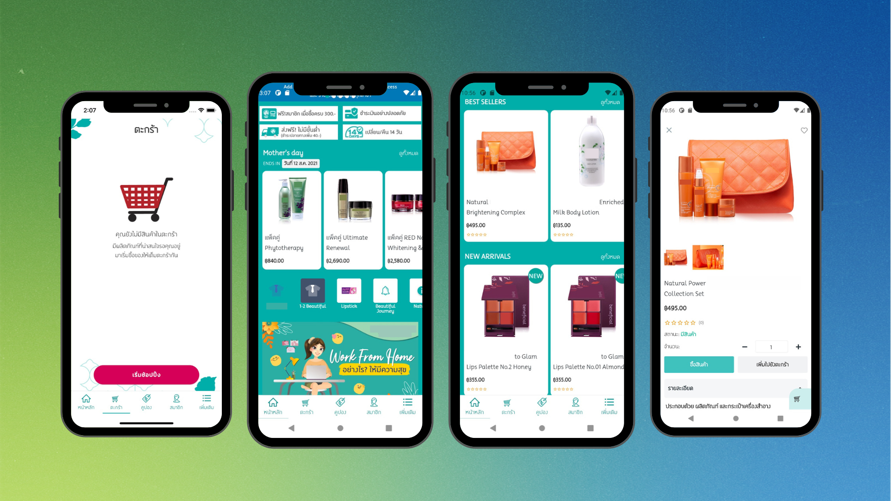
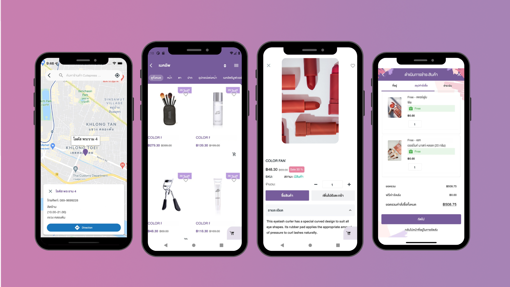
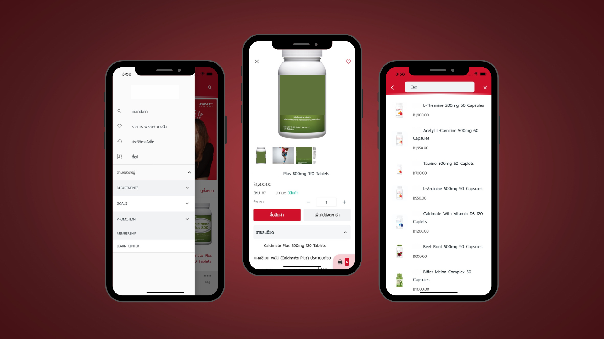

# 🏪 ShopNestMobile

> **ShopNestMobile** is a mobile application designed for managing shops, browsing products, and handling transactions seamlessly.

---

## 📌 **Screenshots**

Below are some key screenshots from the application:

  
  
  

---

## 📋 **Overview**
- This app allows users to **browse shops**, **view product details**, and **manage transactions**.
- Built using **Flutter** with state management for smooth performance.
- Includes features like **shop location mapping**, **cart management**, and **real-time notifications**.
